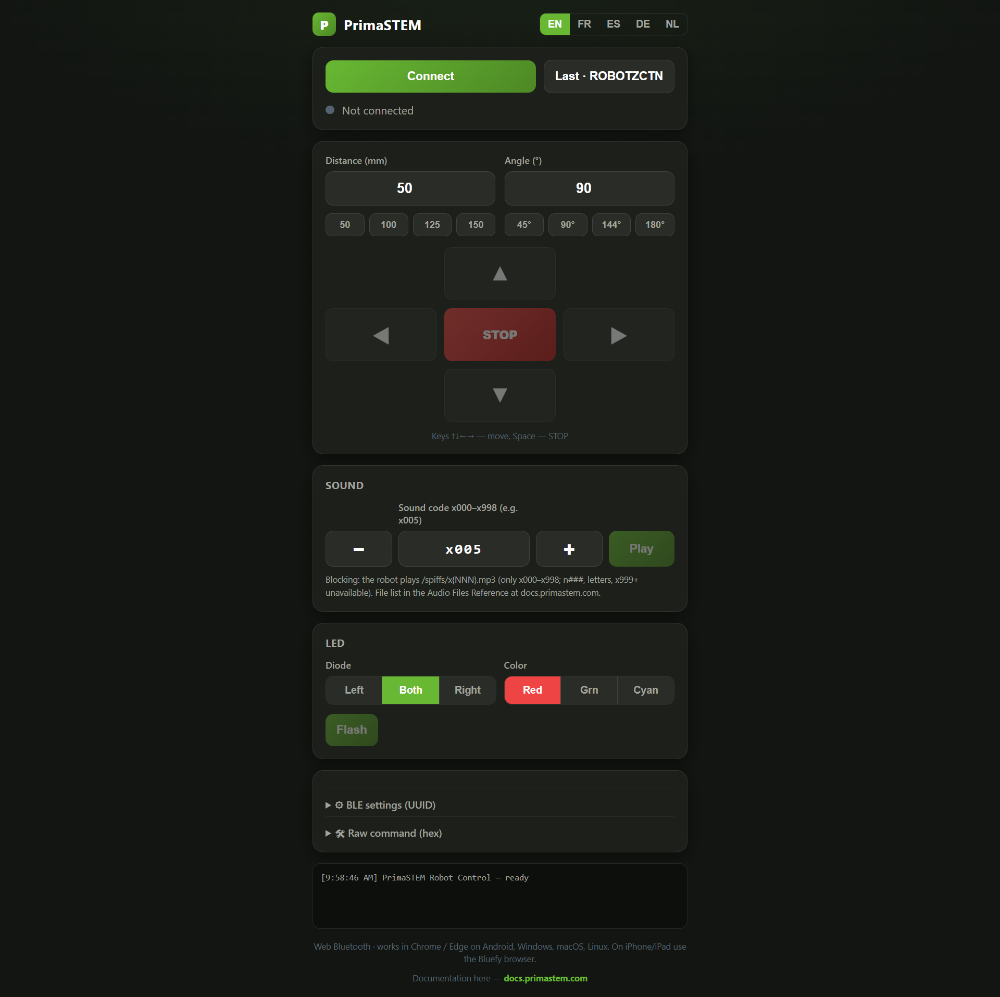
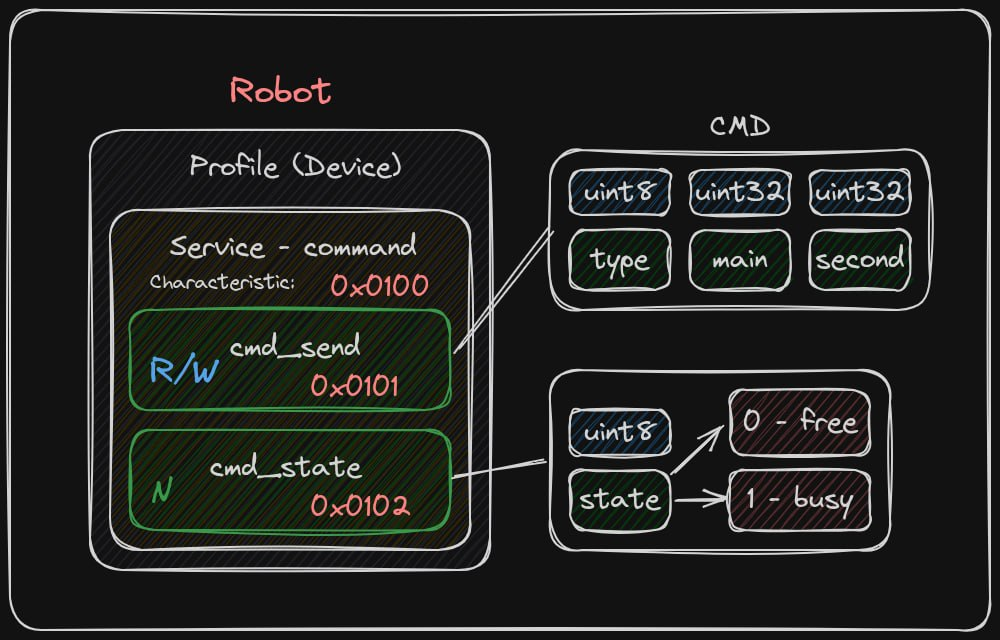
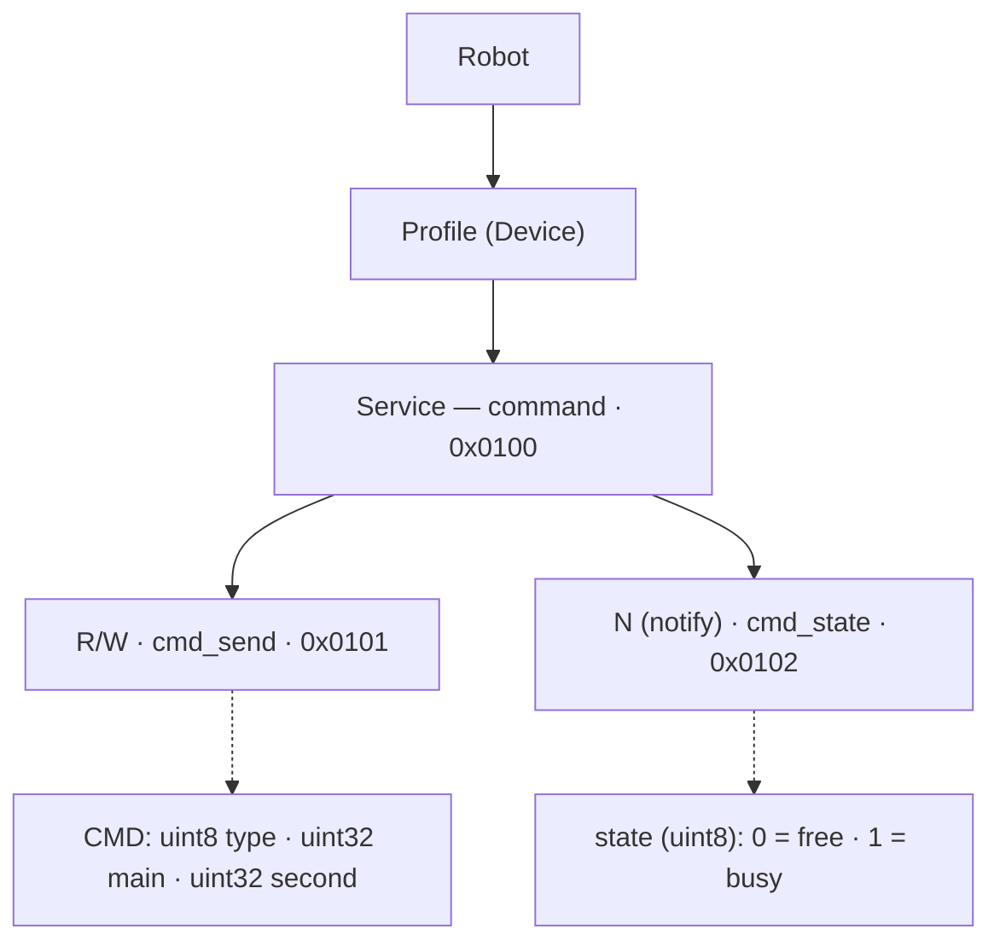

<!-- Language: **English** · [Русский](README.ru.md) -->

# PrimaSTEM Robot — BLE Control

**English** · [Русский](README.ru.md)

Browser-based control panel for the PrimaSTEM educational robot over **Bluetooth Low Energy**, using the [Web Bluetooth API](https://developer.mozilla.org/docs/Web/API/Web_Bluetooth_API). No app install, no build step — a single self-contained HTML file.

🔗 **Live:** https://control.primastem.com · 📚 **Docs:** [docs.primastem.com](https://docs.primastem.com)

<p align="center">
  
</p>

## Features

- **Connect** to any `ROBOT*` device and reconnect to the last one by name.
- **Movement** — forward / back / turn left / right, with editable distance (mm) and angle (°), quick presets, and an emergency **STOP**.
- **Keyboard control** — arrow keys move, `Space` stops (ignored while typing in a field).
- **Sound** — play any on-board clip `x000`–`x998` with `−`/`+` steppers.
- **LED** — left / both / right diode in red / green / cyan, plus a *Flash* action.
- **Program sequencer** — a collapsible "Program" card: chain steps (move / turn / sound / LED / pause), reorder / duplicate / delete them, then run the sequence. Each blocking command waits for the robot's `free` state before the next runs; loop the whole program ×N, with an emergency stop. Programs are saved across sessions.
- **Raw command sender** — craft any 9-byte packet by hand (`type` / `main` / `second`, or a raw hex string) for protocol probing.
- **Busy/free status** — subscribes to the robot's state characteristic and locks the UI while the robot is busy, with a 15 s watchdog so a missed `free` never freezes the controls.
- **Multilingual** — English / Français / Español / Deutsch / Nederlands, remembered across sessions.
- **PrimaSTEM dark theme**, mobile-first layout.

## Quick start

### Use it online
Open **https://control.primastem.com** in Chrome or Edge, click **Connect**, pick your robot.

### Run locally
Web Bluetooth requires `https://` or `localhost` — it will **not** work from a `file://` path. Serve the folder over HTTP:

```bash
python -m http.server 8000
# then open http://localhost:8000/ in Chrome / Edge
```

## Browser support

| Platform | Browser | Web Bluetooth |
| --- | --- | --- |
| Android | Chrome / Edge | ✅ |
| Windows / macOS / Linux | Chrome / Edge | ✅ |
| iOS / iPadOS | Safari | ❌ — use the [Bluefy](https://apps.apple.com/app/bluefy-web-ble-browser/id1492822055) browser |

---

# BLE Protocol





## Overview

The robot is controlled over Bluetooth Low Energy. The controlling app sends the robot a data packet — a command:

1. The controller writes a command to the command characteristic.
2. When the robot starts executing it, it reports the `busy` state.
3. When the command is complete, the robot reports the `free` state.
4. The next command may be sent only after `free` is returned.

> ℹ️ State is reported only for **blocking** commands (see the table below). Non-blocking commands send no status.

## BLE service and characteristics

The robot exposes a single BLE service `0x0100` with two characteristics:

| Characteristic | Short | Properties | Purpose |
| --- | --- | --- | --- |
| Command | `0x0101` | Read, Write | Receives control commands |
| State | `0x0102` | Subscribe (notify) | Reports the robot's readiness |

State characteristic `0x0102` values:

| Byte | State | Meaning |
| --- | --- | --- |
| `0x00` | `free` | Robot finished the command and is free |
| `0x01` | `busy` | Robot started executing a command |

## Full UUIDs (128-bit) — required to connect

> ⚠️ **Important.** `0x0100`, `0x0101`, `0x0102` above are **short labels**, not the real UUIDs. The firmware uses its own 128-bit base, so you **cannot** connect using the short numbers on the standard Bluetooth base (`0000xxxx-0000-1000-8000-00805f9b34fb`). A client (Web Bluetooth, nRF Connect, a mobile app) must use the full UUIDs below.

| Object | Short | Full UUID (128-bit) |
| --- | --- | --- |
| Service "command" | `0x0100` | `bd9e1632-0100-4d63-ad5f-27f115379843` |
| Command characteristic (`cmd_send`) | `0x0101` | `bd9e1632-0101-4d63-ad5f-27f115379843` |
| State characteristic (`cmd_state`) | `0x0102` | `bd9e1632-0102-4d63-ad5f-27f115379843` |

<details>
<summary>How these UUIDs are derived</summary>

In the firmware the UUID is built by a macro:

```c
#define UUID_CREATE(a) \
    0x43, 0x98, 0x37, 0x15, 0xF1, 0x27, 0x5F, 0xAD, 0x63, 0x4D, \
    (uint8_t)(a), (uint8_t)((a) >> 8), 0x32, 0x16, 0x9E, 0xBD
```

The macro lays out 16 bytes in **little-endian** order. The 16-bit number `a` goes into bytes 10–11 (low byte first, then high). Reverse the byte order to get the canonical string:

```
bytes (LE):  43 98 37 15 F1 27 5F AD 63 4D | a_low a_high | 32 16 9E BD
reversed:    BD 9E 16 32 | a_high a_low | 4D 63 | AD 5F | 27 F1 15 37 98 43
string:      bd9e1632-AAAA-4d63-ad5f-27f115379843   (AAAA = a in hex)
```

General formula: **`bd9e1632-<a:04x>-4d63-ad5f-27f115379843`**. For `a = 0x0100` → `bd9e1632-0100-4d63-ad5f-27f115379843`.

</details>

## Command structure

A command is **9 bytes** long:

| Field | Size | Type | Description |
| --- | --- | --- | --- |
| `type` | 1 byte | `enum` | Command type |
| `main` | 4 bytes | `uint32_t` | Main parameter |
| `second` | 4 bytes | `uint32_t` | Auxiliary parameter |

> ℹ️ **Byte order.** Both `main` and `second` are sent little-endian: the value `0x66` is transmitted as `0x66 0x00 0x00 0x00`.

### Encoding character parameters (`'f'`, `'l'`, `'r'`…)

`cmd_move`, `cmd_led` and `cmd_conf` expect the **ASCII code of a single character** in `main`/`second`, not a string. The character goes into the **low (rightmost) byte**; with little-endian transmission that byte comes **first** in the packet.

| Char | ASCII | `uint32` | Bytes (LE) |
| --- | --- | --- | --- |
| `'f'` | `0x66` | `0x00000066` | `66 00 00 00` |
| `'b'` | `0x62` | `0x00000062` | `62 00 00 00` |
| `'l'` | `0x6C` | `0x0000006C` | `6C 00 00 00` |
| `'r'` | `0x72` | `0x00000072` | `72 00 00 00` |
| `'g'` | `0x67` | `0x00000067` | `67 00 00 00` |
| `'w'` | `0x77` | `0x00000077` | `77 00 00 00` |
| `'i'` | `0x69` | `0x00000069` | `69 00 00 00` |

```js
function buildPacket(type, main, second){
  const dv = new DataView(new ArrayBuffer(9));
  dv.setUint8(0, type);
  dv.setUint32(1, main  >>> 0, true);  // little-endian
  dv.setUint32(5, second >>> 0, true); // little-endian
  return dv.buffer;
}
// move forward 150 mm:
buildPacket(0x02, 'f'.charCodeAt(0), 150);
```

`cmd_sound` is the exception — its `main` is a **number** (the file index), not a character.

## Command list

Codes match the firmware enum `ble_cmd_type_t`:

```c
typedef enum __attribute__((packed)) {
    ble_cmd_log   = 0x01,
    ble_cmd_move  = 0x02,
    ble_cmd_led   = 0x03,
    ble_cmd_sound = 0x04,
    ble_cmd_conf  = 0x05,
    ble_cmd_lvl   = 0x06,
    ble_cmd_name  = 0xAA,
    ble_cmd_break = 0xFF,
} ble_cmd_type_t;
```

| Command | Byte | Blocking |
| --- | --- | --- |
| `cmd_log` | `0x01` | No |
| `cmd_move` | `0x02` | Yes |
| `cmd_led` | `0x03` | Yes |
| `cmd_sound` | `0x04` | Yes |
| `cmd_conf` | `0x05` | Yes |
| `cmd_lvl` | `0x06` | — (undocumented) |
| `cmd_name` | `0xAA` | Reset |
| `cmd_break` | `0xFF` | No |

## Command reference

### `cmd_log` (`0x01`)
Prints a log. No parameters.

### `cmd_break` (`0xFF`)
Interrupts the current command.

### `cmd_name` (`0xAA`) — Reset
Sets the robot's name and reboots it. `main` — 4 characters appended to the name.

### `cmd_move` (`0x02`)
Movement.
- `main` — direction (`uint8_t` in the rightmost byte): `'f'` forward, `'b'` backward, `'r'` right (CW), `'l'` left (CCW).
- `second` — movement size: angle in degrees for a turn, distance in mm for translation.

### `cmd_led` (`0x03`)
Turns the robot's LEDs on/off.
- `main` — LED position: `'l'` left, `'r'` right, `'b'` both.
- `second` — color: `'r'` red, `'g'` green, `'b'` cyan, `'w'` white.

### `cmd_sound` (`0x04`)
Plays an audio file. **Blocking**: the robot sends `busy`, plays, then `free`.
- `main` — the file **number** (`uint32`), `0…998`. The robot builds the name with `sprintf("/spiffs/x%03d.mp3", main)`, always `x` + 3 zero-padded digits. `main=5` → `/spiffs/x005.mp3`, `main=700` → `/spiffs/x700.mp3`.
- `second` — unused.
- ⚠️ If `main ≥ 999`, nothing plays (firmware logs `Too long number audio file`).
- ⚠️ Only `x000`–`x998` are reachable; other-prefixed names (`n###`, `cfor`, `sqrt`…) are **not** available — the prefix is hard-coded as `x`.

<details>
<summary>Firmware source</summary>

```c
case cmd_prop[ble_cmd_sound].code:
    is_audio_play = true;
    if (cmd.main < 999) {
        ble_cmd_state_send(busy_state);
        sprintf(audio_name_buffer, "/spiffs/x%03d.mp3", (int) cmd.main);
        cmd_disable_led_timer();
        audio_play_file_blocking(audio_name_buffer);
        cmd_enable_led_timer();
        ble_cmd_state_send(free_state);
    } else
        ESP_LOGW(tag, "Too long number audio file.");
    break;
```

</details>

### `cmd_conf` (`0x05`)
Starts robot configuration.
- `main` — `'l'` length calibration, `'i'` inertial-sensor calibration.
- `second` — parameter: for length calibration, the length of the line drawn at the default value (150 mm); for the IMU, empty.

### `cmd_lvl` (`0x06`)
> ⚠️ Present in the firmware enum but its purpose and parameters are undocumented in the source materials. Needs clarification — probe it with the **Raw command sender**.

## Ready-to-use packet examples (hex)

All 9 bytes, in transmission order. Verified on the test robot ROBOTZCTN.

### Movement (`cmd_move`, 0x02) — blocking

| Action | `main` | `second` | Packet |
| --- | --- | --- | --- |
| Forward 90 mm | `'f'` | `90` (`0x5A`) | `02 66 00 00 00 5A 00 00 00` |
| Forward 150 mm | `'f'` | `150` (`0x96`) | `02 66 00 00 00 96 00 00 00` |
| Backward 100 mm | `'b'` | `100` (`0x64`) | `02 62 00 00 00 64 00 00 00` |
| Turn left 90° | `'l'` | `90` (`0x5A`) | `02 6C 00 00 00 5A 00 00 00` |
| Turn right 90° | `'r'` | `90` (`0x5A`) | `02 72 00 00 00 5A 00 00 00` |
| Turn right 144° | `'r'` | `144` (`0x90`) | `02 72 00 00 00 90 00 00 00` |

> `second` is a plain decimal `uint32` in LE. 150 = `0x96` → `96 00 00 00`. 300 = `0x12C` → `2C 01 00 00`.

### LEDs (`cmd_led`, 0x03) — blocking

The LEDs change color for ~1 s, then return to white.

| Action | `main` | `second` | Packet |
| --- | --- | --- | --- |
| Both LEDs white | `'b'` | `'w'` | `03 62 00 00 00 77 00 00 00` |
| Both LEDs red | `'b'` | `'r'` | `03 62 00 00 00 72 00 00 00` |
| Left LED green | `'l'` | `'g'` | `03 6C 00 00 00 67 00 00 00` |
| Right LED cyan | `'r'` | `'b'` | `03 72 00 00 00 62 00 00 00` |

### Sound (`cmd_sound`, 0x04) — blocking

| Action | `main` | File | Packet |
| --- | --- | --- | --- |
| Reaction "Hi!" | `5` | `x005.mp3` | `04 05 00 00 00 00 00 00 00` |
| Reaction "Bye!" | `9` | `x009.mp3` | `04 09 00 00 00 00 00 00 00` |
| Letter (x700) | `700` (`0x2BC`) | `x700.mp3` | `04 BC 02 00 00 00 00 00 00` |
| System (x990) | `990` (`0x3DE`) | `x990.mp3` | `04 DE 03 00 00 00 00 00 00` |

### Calibration (`cmd_conf`, 0x05) — blocking

| Action | `main` | `second` | Packet |
| --- | --- | --- | --- |
| Length calibration (150 mm reference) | `'l'` | `150` (`0x96`) | `05 6C 00 00 00 96 00 00 00` |
| IMU calibration | `'i'` | `0` | `05 69 00 00 00 00 00 00 00` |

### Robot name (`cmd_name`, 0xAA) — Reset

`main` — 4 ASCII characters of the name (char[0] is the low byte). The robot becomes `ROBOT<chars>` and reboots.

| Action | `main` | Packet |
| --- | --- | --- |
| Name `ROBOTABCD` | `'A','B','C','D'` | `AA 41 42 43 44 00 00 00 00` |

### Stop (`cmd_break`, 0xFF) — non-blocking

```
FF 00 00 00 00 00 00 00 00
```

### Raw test of `cmd_lvl` (0x06)

Purpose unknown — for empirical probing. Example with `main=5`:

```
06 05 00 00 00 00 00 00 00
```

## Robot name

Before its first connection the robot is named `ROBOTAAAA`. Connect and change the last 4 characters with `cmd_name`; the robot stores them, so it can be found by that name afterward. Sending `[0xAA, 'ABCD', 0x00000000]` sets `ROBOTABCD` (packet `AA 41 42 43 44 00 00 00 00`). The name can be changed at any time.

## Client connection (Web Bluetooth)

```js
const SVC = 'bd9e1632-0100-4d63-ad5f-27f115379843';
const CMD = 'bd9e1632-0101-4d63-ad5f-27f115379843';
const STT = 'bd9e1632-0102-4d63-ad5f-27f115379843';

const device  = await navigator.bluetooth.requestDevice({
  filters: [{ namePrefix: 'ROBOT' }],   // every robot is named ROBOTxxxx
  optionalServices: [SVC]
});
const server  = await device.gatt.connect();
const service = await server.getPrimaryService(SVC);
const cmdChar = await service.getCharacteristic(CMD);   // write commands
const sttChar = await service.getCharacteristic(STT);   // notify status

await sttChar.startNotifications();
sttChar.addEventListener('characteristicvaluechanged', e => {
  const busy = e.target.value.getUint8(0) === 0x01;     // 0=free, 1=busy
});

// send a command (writeValueWithResponse, since the characteristic is R/W):
await cmdChar.writeValueWithResponse(buildPacket(0x02, 'f'.charCodeAt(0), 150));
```

> ⚠️ Web Bluetooth works only over `https://` or `localhost` (not `file://`).

## Notes

- Non-blocking commands (`cmd_log`, `cmd_break`) send no status. All other executable commands are blocking — wait for `free` before the next.
- A `Reset` command (`cmd_name`) reboots the robot.
- **Hardware quirk (per-unit):** on the test robot ROBOTZCTN the left and right LEDs are physically swapped — `'l'` lights the right LED and `'r'` the left. This is a build defect of that specific robot, not the protocol; the web app compensates for it on the client side.

---

<sub>Made by PrimaSTEM · [docs.primastem.com](https://docs.primastem.com)</sub>
