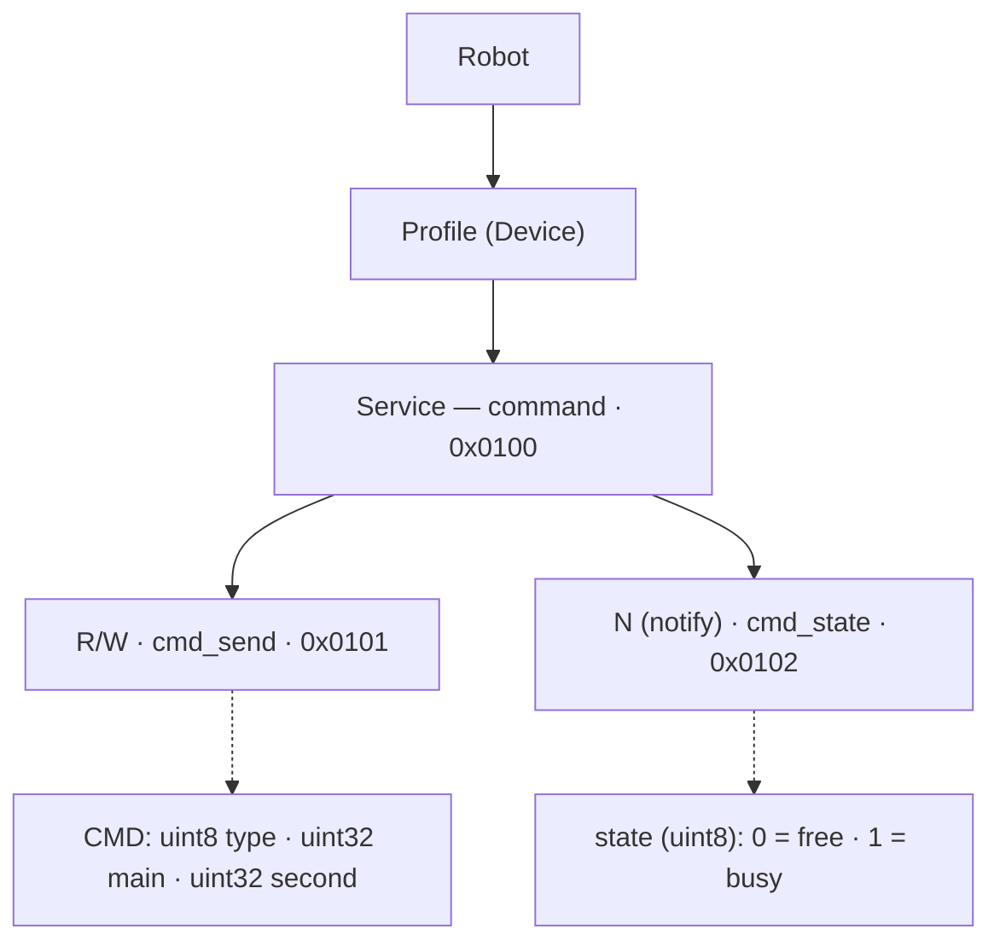

# PrimaSTEM Robot BLE Control Protocol


## Structure Diagram (text version)



> ℹ️ In the diagram, the characteristics are labeled `cmd_send` (`0x0101`) and `cmd_state` (`0x0102`), and `0x0100` is marked as the Service "command". The same UUIDs are used in the text below.

## Overview

The robot is controlled over Bluetooth Low Energy (BLE). The controlling application sends the robot a data packet — a command. The exchange works as follows:

1. The controller writes a command to the command characteristic.
2. When the robot starts executing the command, it reports the `busy` state.
3. When the command is complete, the robot reports the `free` state.
4. The next command may be sent only after the `free` state is returned.

> ℹ️ The state is reported only for **blocking** commands (see the table below). Non-blocking commands do not send a status.

## BLE Service and Characteristics

The robot exposes a single BLE service `0x0100` with two characteristics:

| Characteristic | UUID | Properties | Purpose |
| --- | --- | --- | --- |
| Command | `0x0101` | Read, Write | Receives control commands |
| State | `0x0102` | Subscribe (notify) | Reports the robot's readiness |

Values of the state characteristic `0x0102`:

| Byte | State | Meaning |
| --- | --- | --- |
| `0x00` | `free` | The robot has finished the command and is free |
| `0x01` | `busy` | The robot has started executing a command |

## Full UUIDs (128-bit) — required to connect

> ⚠️ **Important.** The numbers `0x0100`, `0x0101`, `0x0102` above are **short labels**, not the real UUIDs. The firmware uses its own 128-bit base. You **cannot** connect using the short numbers on the standard Bluetooth base (`0000xxxx-0000-1000-8000-00805f9b34fb`) — a client (Web Bluetooth, nRF Connect, a mobile app) must use the full UUIDs below.

| Object | Short | Full UUID (128-bit) |
| --- | --- | --- |
| Service "command" | `0x0100` | `bd9e1632-0100-4d63-ad5f-27f115379843` |
| Command characteristic (`cmd_send`) | `0x0101` | `bd9e1632-0101-4d63-ad5f-27f115379843` |
| State characteristic (`cmd_state`) | `0x0102` | `bd9e1632-0102-4d63-ad5f-27f115379843` |

### How these UUIDs are derived

In the firmware the UUID is built by a macro:

```c
#define UUID_CREATE(a) \
    0x43, 0x98, 0x37, 0x15, 0xF1, 0x27, 0x5F, 0xAD, 0x63, 0x4D, \
    (uint8_t)(a), (uint8_t)((a) >> 8), 0x32, 0x16, 0x9E, 0xBD
```

The macro lays out 16 bytes in **little-endian** order (least-significant byte first). The 16-bit number `a` is placed in bytes at indices 10 and 11 (low byte of `a` first, then high byte). To obtain the canonical UUID string, **reverse the byte order**:

```
bytes (LE):  43 98 37 15 F1 27 5F AD 63 4D | a_low a_high | 32 16 9E BD
reversed:    BD 9E 16 32 | a_high a_low | 4D 63 | AD 5F | 27 F1 15 37 98 43
string:      bd9e1632-AAAA-4d63-ad5f-27f115379843   (where AAAA = a in hex)
```

So the general formula is: **`bd9e1632-<a:04x>-4d63-ad5f-27f115379843`**. For example, `a = 0x0100` yields `bd9e1632-0100-4d63-ad5f-27f115379843`.

## Command Structure

A control command is **9 bytes** long and is described by the `cmd` structure:

| Field | Size | Type | Description |
| --- | --- | --- | --- |
| `type` | 1 byte | `enum` | Command type |
| `main` | 4 bytes | `uint32_t` | Main command parameter |
| `second` | 4 bytes | `uint32_t` | Auxiliary command parameter |

> ℹ️ **Byte order.** In the example below, parameters are sent little-endian: the value `0x66` is transmitted as `0x66 0x00 0x00 0x00`. Use this order when building the packet.

## Command List

Command codes match the firmware enumeration `ble_cmd_type_t`:

```c
typedef enum __attribute__((packed)) {
    ble_cmd_log   = 0x01,
    ble_cmd_move  = 0x02,
    ble_cmd_led   = 0x03,
    ble_cmd_sound = 0x04,
    ble_cmd_conf  = 0x05,
    ble_cmd_lvl   = 0x06,
    ble_cmd_name  = 0xAA,
    ble_cmd_break = 0xFF,
} ble_cmd_type_t;
```

| Command | Byte | Blocking |
| --- | --- | --- |
| `cmd_log` | `0x01` | No |
| `cmd_move` | `0x02` | Yes |
| `cmd_led` | `0x03` | Yes |
| `cmd_sound` | `0x04` | Yes |
| `cmd_conf` | `0x05` | Yes |
| `cmd_lvl` | `0x06` | — (undocumented) |
| `cmd_name` | `0xAA` | Reset |
| `cmd_break` | `0xFF` | No |

## Command Reference

### `cmd_log` (`0x01`)
Prints a log. No parameters.

### `cmd_break` (`0xFF`)
Interrupts execution of the current command.

### `cmd_name` (`0xAA`) — Reset
Sets the robot's name and reboots it.
- `main` — 4 characters to be appended to the name.

### `cmd_move` (`0x02`)
Movement command.
- `main` — movement direction (`uint8_t` in the rightmost byte):
  - `'f'` — forward
  - `'b'` — backward
  - `'r'` — right (clockwise turn)
  - `'l'` — left (counter-clockwise turn)
- `second` — movement "size":
  - for rotation — angle in degrees;
  - for translation — distance in mm.

### `cmd_led` (`0x03`)
Turns the robot's LEDs on/off.
- `main` — LED position (`uint8_t` in the rightmost byte):
  - `'l'` — left LED
  - `'r'` — right LED
  - `'b'` — both LEDs
- `second` — color (`uint8_t` in the rightmost byte):
  - `'r'` — red
  - `'g'` — green
  - `'b'` — cyan
  - `'w'` — white

### `cmd_sound` (`0x04`)
Plays an audio file. **Blocking** (contrary to an earlier version of this doc): the robot sends `busy`, plays the file, then `free`.
- `main` — the file **number** (`uint32`), `0…998`. The robot builds the name with `sprintf("/spiffs/x%03d.mp3", main)`, i.e. always `x` + 3 zero-padded digits. E.g. `main=5` → `/spiffs/x005.mp3`, `main=700` → `/spiffs/x700.mp3`.
- `second` — unused.
- ⚠️ If `main ≥ 999`, nothing plays (firmware logs `Too long number audio file`).
- ⚠️ Only `x000`–`x998` files are reachable. Other-prefixed names from the Audio Files Reference (`n###` numbers, `cfor`/`sqrt`, etc.) are NOT available over this channel — the prefix is hard-coded as `x`.

Confirmed by firmware source:
```c
case cmd_prop[ble_cmd_sound].code:
    is_audio_play = true;
    if (cmd.main < 999) {
        ble_cmd_state_send(busy_state);
        sprintf(audio_name_buffer, "/spiffs/x%03d.mp3", (int) cmd.main);
        cmd_disable_led_timer();
        audio_play_file_blocking(audio_name_buffer);
        cmd_enable_led_timer();
        ble_cmd_state_send(free_state);
    } else
        ESP_LOGW(tag, "Too long number audio file.");
    break;
```

### `cmd_conf` (`0x05`)
Starts the robot configuration process.
- `main` — specific configuration command (`uint8_t` in the rightmost byte):
  - `'l'` — length calibration;
  - `'i'` — inertial sensor calibration.
- `second` — configuration parameter:
  - for length calibration — the length of the line drawn by the robot using the default value (150 mm);
  - for the inertial sensor — empty.

### `cmd_lvl` (`0x06`)
> ⚠️ This command is present in the firmware enum `ble_cmd_type_t`, but its purpose and parameters (`main`, `second`) are not described in the source materials. Needs clarification.

## Example: Move Forward 90 mm

| `type` | `main` | `second` |
| --- | --- | --- |
| `cmd_move` | forward | 90 mm |
| `0x02` | `'f'` | `90` |
| `0x02` | `0x00000066` | `0x0000005A` |

Resulting packet to send (e.g., via nRF Connect):

```
0x02 0x66 0x00 0x00 0x00 0x5A 0x00 0x00 0x00
```

## Robot Name

Before the first connection, the robot is named `ROBOTAAAA`. You can connect to it and change the last 4 characters with the `cmd_name` command. The robot saves these characters, and afterward this robot can be found by them.

For example, sending `[0xAA, 'ABCD', 0x00000000]` sets the name `ROBOTABCD`. The name can be changed at any time, even if a name other than `ROBOTAAAA` is already set.

## Notes

- Non-blocking commands do not trigger a status update.
- A command marked as `Reset` (`cmd_name`) causes the robot to reboot.
