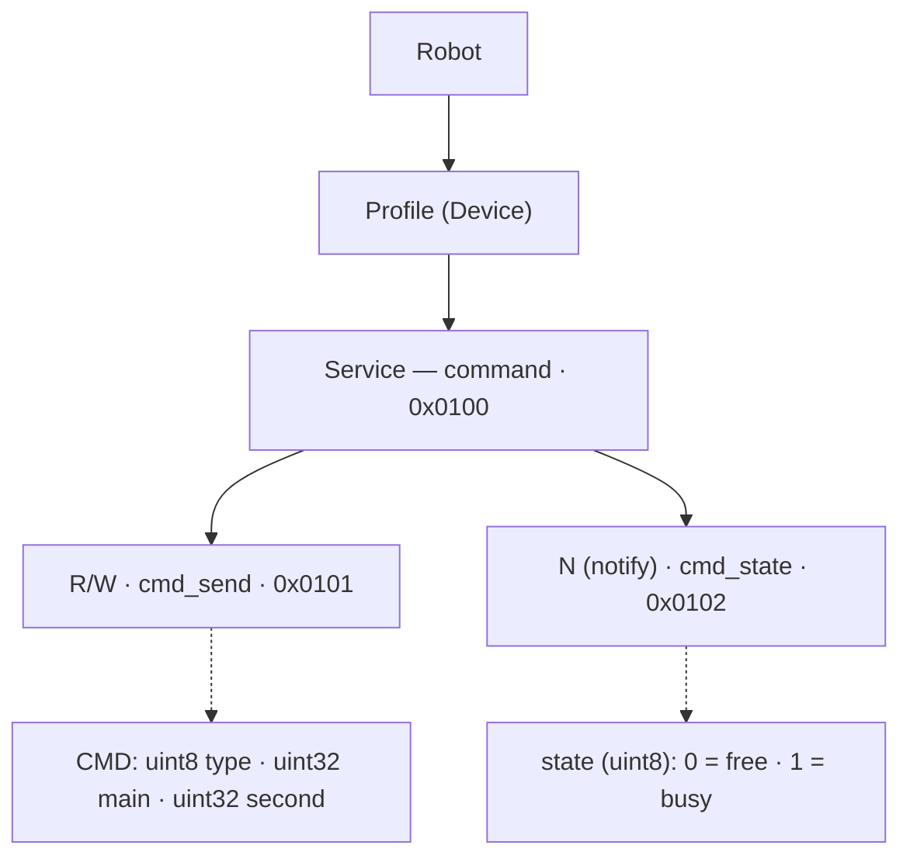

# BLE-протокол управления роботом PrimaSTEM


## Схема структуры (текстовая версия)



> ℹ️ На схеме характеристики подписаны как `cmd_send` (`0x0101`) и `cmd_state` (`0x0102`), а `0x0100` обозначен как Service «command». В тексте ниже используются те же UUID.

## Обзор

Робот управляется через Bluetooth Low Energy (BLE). Управляющая программа передаёт роботу пакет данных — команду. Логика обмена следующая:

1. Управляющее устройство записывает команду в характеристику команд.
2. Когда робот начинает исполнять команду, он сообщает состояние `busy` (занят).
3. Когда команда исполнена, робот сообщает состояние `free` (свободен).
4. Следующую команду можно отправлять только после возврата состояния `free`.

> ℹ️ Состояние возвращается только для **блокирующих** команд (см. таблицу ниже). Неблокирующие команды статус не отправляют.

## BLE-сервис и характеристики

Робот предоставляет единственный BLE-сервис `0x0100` с двумя характеристиками:

| Характеристика | UUID | Свойства | Назначение |
| --- | --- | --- | --- |
| Команды | `0x0101` | Чтение, запись | Приём управляющих команд |
| Состояние | `0x0102` | Подписка (notify) | Сообщает о готовности робота |

Значения характеристики состояния `0x0102`:

| Байт | Состояние | Значение |
| --- | --- | --- |
| `0x00` | `free` | Робот закончил исполнение команды и свободен |
| `0x01` | `busy` | Робот начал исполнять команду |

## Полные UUID (128-бит) — обязательно для подключения

> ⚠️ **Важно.** Номера `0x0100`, `0x0101`, `0x0102` выше — это **короткие ярлыки**, а не реальные UUID. Прошивка использует собственную 128-битную базу. Подключиться по коротким номерам на стандартной базе Bluetooth (`0000xxxx-0000-1000-8000-00805f9b34fb`) **нельзя** — клиент (Web Bluetooth, nRF Connect, мобильное приложение) должен использовать полные UUID ниже.

| Объект | Короткий | Полный UUID (128-бит) |
| --- | --- | --- |
| Сервис «command» | `0x0100` | `bd9e1632-0100-4d63-ad5f-27f115379843` |
| Характеристика команд (`cmd_send`) | `0x0101` | `bd9e1632-0101-4d63-ad5f-27f115379843` |
| Характеристика состояния (`cmd_state`) | `0x0102` | `bd9e1632-0102-4d63-ad5f-27f115379843` |

### Как получаются эти UUID

В прошивке UUID собирается макросом:

```c
#define UUID_CREATE(a) \
    0x43, 0x98, 0x37, 0x15, 0xF1, 0x27, 0x5F, 0xAD, 0x63, 0x4D, \
    (uint8_t)(a), (uint8_t)((a) >> 8), 0x32, 0x16, 0x9E, 0xBD
```

Макрос задаёт 16 байт в порядке **little-endian** (младший байт первым). 16-битный номер `a` подставляется в байты с индексами 10 и 11 (сначала младший байт `a`, затем старший). Чтобы получить канонический UUID-строку, нужно **развернуть порядок байт**:

```
байты (LE):  43 98 37 15 F1 27 5F AD 63 4D | a_low a_high | 32 16 9E BD
реверс:      BD 9E 16 32 | a_high a_low | 4D 63 | AD 5F | 27 F1 15 37 98 43
строка:      bd9e1632-AAAA-4d63-ad5f-27f115379843   (где AAAA = a в hex)
```

То есть общая формула: **`bd9e1632-<a:04x>-4d63-ad5f-27f115379843`**. Например, для `a = 0x0100` получается `bd9e1632-0100-4d63-ad5f-27f115379843`.

## Структура команды

Управляющая команда занимает **9 байт** и описывается структурой `cmd`:

| Поле | Размер | Тип | Описание |
| --- | --- | --- | --- |
| `type` | 1 байт | `enum` | Тип команды |
| `main` | 4 байта | `uint32_t` | Основной параметр команды |
| `second` | 4 байта | `uint32_t` | Вспомогательный параметр команды |

> ℹ️ **Порядок байт.** Оба поля `main` и `second` передаются в порядке little-endian (младший байт первым): значение `0x66` отправляется как `0x66 0x00 0x00 0x00`. Используйте этот порядок при формировании пакета.

### Как кодировать символьные параметры (`'f'`, `'l'`, `'r'`…)

Многие команды (`cmd_move`, `cmd_led`, `cmd_conf`) ожидают в `main`/`second` **ASCII-код одного символа**, а не строку. Символ кладётся в **младший (правый) байт** 32-битного числа, остальные байты — нули. При little-endian-передаче этот байт идёт **первым** в пакете.

| Символ | ASCII | Значение `uint32` | Байты в пакете (LE) |
| --- | --- | --- | --- |
| `'f'` | `0x66` | `0x00000066` | `66 00 00 00` |
| `'b'` | `0x62` | `0x00000062` | `62 00 00 00` |
| `'l'` | `0x6C` | `0x0000006C` | `6C 00 00 00` |
| `'r'` | `0x72` | `0x00000072` | `72 00 00 00` |
| `'g'` | `0x67` | `0x00000067` | `67 00 00 00` |
| `'w'` | `0x77` | `0x00000077` | `77 00 00 00` |
| `'i'` | `0x69` | `0x00000069` | `69 00 00 00` |

Пример на JavaScript (Web Bluetooth):
```js
function buildPacket(type, main, second){
  const dv = new DataView(new ArrayBuffer(9));
  dv.setUint8(0, type);
  dv.setUint32(1, main  >>> 0, true);  // little-endian
  dv.setUint32(5, second >>> 0, true); // little-endian
  return dv.buffer;
}
// движение вперёд на 150 мм:
buildPacket(0x02, 'f'.charCodeAt(0), 150);
```

`cmd_sound` — исключение: его `main` это **число** файла, а не символ (см. ниже).

## Список команд

Коды команд соответствуют перечислению прошивки `ble_cmd_type_t`:

```c
typedef enum __attribute__((packed)) {
    ble_cmd_log   = 0x01,
    ble_cmd_move  = 0x02,
    ble_cmd_led   = 0x03,
    ble_cmd_sound = 0x04,
    ble_cmd_conf  = 0x05,
    ble_cmd_lvl   = 0x06,
    ble_cmd_name  = 0xAA,
    ble_cmd_break = 0xFF,
} ble_cmd_type_t;
```

| Команда | Байт | Блокирующая |
| --- | --- | --- |
| `cmd_log` | `0x01` | Нет |
| `cmd_move` | `0x02` | Да |
| `cmd_led` | `0x03` | Да |
| `cmd_sound` | `0x04` | Да |
| `cmd_conf` | `0x05` | Да |
| `cmd_lvl` | `0x06` | — (не описана) |
| `cmd_name` | `0xAA` | Reset |
| `cmd_break` | `0xFF` | Нет |

## Описание команд

### `cmd_log` (`0x01`)
Печатает лог. Параметров нет.

### `cmd_break` (`0xFF`)
Прерывает исполнение текущей команды.

### `cmd_name` (`0xAA`) — Reset
Устанавливает имя робота и перезагружает его.
- `main` — 4 символа, которые будут добавлены к имени.

### `cmd_move` (`0x02`)
Команда перемещения.
- `main` — направление перемещения (`uint8_t` в правом байте):
  - `'f'` — вперёд
  - `'b'` — назад
  - `'r'` — вправо (поворот по часовой стрелке)
  - `'l'` — влево (поворот против часовой стрелки)
- `second` — «размер» движения:
  - для вращения — угол в градусах;
  - для перемещения — расстояние в мм.

### `cmd_led` (`0x03`)
Включение/выключение светодиодов робота.
- `main` — положение диода (`uint8_t` в правом байте):
  - `'l'` — левый диод
  - `'r'` — правый диод
  - `'b'` — оба диода
- `second` — цвет (`uint8_t` в правом байте):
  - `'r'` — красный
  - `'g'` — зелёный
  - `'b'` — голубой
  - `'w'` — белый

### `cmd_sound` (`0x04`)
Воспроизводит аудиофайл. **Блокирующая** (вопреки старой версии этого документа): робот отправляет `busy`, проигрывает файл, затем `free`.
- `main` — **число** файла (`uint32`), `0…998`. Робот формирует имя как `sprintf("/spiffs/x%03d.mp3", main)`, то есть всегда `x` + 3 цифры с ведущими нулями. Например `main=5` → `/spiffs/x005.mp3`, `main=700` → `/spiffs/x700.mp3`.
- `second` — не используется.
- ⚠️ Если `main ≥ 999` — файл не воспроизводится (прошивка пишет в лог `Too long number audio file`).
- ⚠️ Доступны **только** файлы `x000`–`x998`. Имена с другим префиксом из Audio Files Reference (`n###` числа, `cfor`/`sqrt` и т. п.) по этому каналу недоступны — префикс жёстко зашит как `x`.

Подтверждено исходником прошивки:
```c
case cmd_prop[ble_cmd_sound].code:
    is_audio_play = true;
    if (cmd.main < 999) {
        ble_cmd_state_send(busy_state);
        sprintf(audio_name_buffer, "/spiffs/x%03d.mp3", (int) cmd.main);
        cmd_disable_led_timer();
        audio_play_file_blocking(audio_name_buffer);
        cmd_enable_led_timer();
        ble_cmd_state_send(free_state);
    } else
        ESP_LOGW(tag, "Too long number audio file.");
    break;
```

### `cmd_conf` (`0x05`)
Запускает процесс настройки робота.
- `main` — конкретная команда настройки (`uint8_t` в правом байте):
  - `'l'` — калибровка длины;
  - `'i'` — калибровка инерционного сенсора.
- `second` — параметр настройки:
  - для калибровки длины — длина линии, нарисованной роботом при значении по умолчанию (150 мм);
  - для инерционного сенсора — пусто.

### `cmd_lvl` (`0x06`)
> ⚠️ Команда присутствует в перечислении прошивки `ble_cmd_type_t`, но её назначение и параметры (`main`, `second`) в исходных материалах не описаны. Требуется уточнение.

## Готовые примеры пакетов (hex)

Все 9 байт, в порядке отправки. Проверено на тестовом роботе ROBOTZCTN.

### Движение (`cmd_move`, 0x02) — блокирующая

| Действие | `main` | `second` | Пакет (9 байт) |
| --- | --- | --- | --- |
| Вперёд 90 мм | `'f'` | `90` (`0x5A`) | `02 66 00 00 00 5A 00 00 00` |
| Вперёд 150 мм | `'f'` | `150` (`0x96`) | `02 66 00 00 00 96 00 00 00` |
| Назад 100 мм | `'b'` | `100` (`0x64`) | `02 62 00 00 00 64 00 00 00` |
| Поворот влево 90° | `'l'` | `90` (`0x5A`) | `02 6C 00 00 00 5A 00 00 00` |
| Поворот вправо 90° | `'r'` | `90` (`0x5A`) | `02 72 00 00 00 5A 00 00 00` |
| Поворот вправо 144° | `'r'` | `144` (`0x90`) | `02 72 00 00 00 90 00 00 00` |

> Размер (`second`) — обычный десятичный `uint32` в LE. 150 = `0x96` → `96 00 00 00`. 300 = `0x12C` → `2C 01 00 00`.

### Светодиоды (`cmd_led`, 0x03) — блокирующая

`main` — диод (`'l'`/`'r'`/`'b'`), `second` — цвет (`'r'`/`'g'`/`'b'`/`'w'`). Диоды на ~секунду меняют цвет, затем возвращаются к белому.

| Действие | `main` | `second` | Пакет (9 байт) |
| --- | --- | --- | --- |
| Оба диода белым | `'b'` | `'w'` | `03 62 00 00 00 77 00 00 00` |
| Оба диода красным | `'b'` | `'r'` | `03 62 00 00 00 72 00 00 00` |
| Левый диод зелёным | `'l'` | `'g'` | `03 6C 00 00 00 67 00 00 00` |
| Правый диод голубым | `'r'` | `'b'` | `03 72 00 00 00 62 00 00 00` |

### Звук (`cmd_sound`, 0x04) — блокирующая

`main` — число файла `0…998`, робот играет `/spiffs/x%03d.mp3`. `second` не используется.

| Действие | `main` | Файл | Пакет (9 байт) |
| --- | --- | --- | --- |
| Реакция «Hi!» | `5` | `x005.mp3` | `04 05 00 00 00 00 00 00 00` |
| Реакция «Bye!» | `9` | `x009.mp3` | `04 09 00 00 00 00 00 00 00` |
| Буква (x700) | `700` (`0x2BC`) | `x700.mp3` | `04 BC 02 00 00 00 00 00 00` |
| Система (x990) | `990` (`0x3DE`) | `x990.mp3` | `04 DE 03 00 00 00 00 00 00` |

> `main ≥ 999` игнорируется (лог `Too long number audio file`). Доступны только `x000`–`x998`.

### Калибровка (`cmd_conf`, 0x05) — блокирующая

| Действие | `main` | `second` | Пакет (9 байт) |
| --- | --- | --- | --- |
| Калибровка длины (эталон 150 мм) | `'l'` | `150` (`0x96`) | `05 6C 00 00 00 96 00 00 00` |
| Калибровка IMU | `'i'` | `0` | `05 69 00 00 00 00 00 00 00` |

### Имя робота (`cmd_name`, 0xAA) — Reset

`main` — 4 ASCII-символа имени, кладутся побайтно (символ[0] — младший байт). Робот станет `ROBOT<символы>` и перезагрузится.

| Действие | `main` | Пакет (9 байт) |
| --- | --- | --- |
| Имя `ROBOTABCD` | `'A','B','C','D'` | `AA 41 42 43 44 00 00 00 00` |

### Стоп (`cmd_break`, 0xFF) — неблокирующая

Прерывает текущую команду. Параметры — нули.

```
FF 00 00 00 00 00 00 00 00
```

### Сырой тест `cmd_lvl` (0x06)

Назначение неизвестно — используйте для опытной проверки. Пример с `main=5`:

```
06 05 00 00 00 00 00 00 00
```

## Имя робота

До первого подключения робот имеет имя `ROBOTAAAA`. К нему можно подключиться и изменить 4 последних символа командой `cmd_name`. Робот сохранит эти символы, и в дальнейшем по ним можно будет находить данного робота.

Например, передача `[0xAA, 'ABCD', 0x00000000]` задаст имя `ROBOTABCD` — пакет `AA 41 42 43 44 00 00 00 00`. Имя можно менять в любой момент, даже если уже установлено имя, отличное от `ROBOTAAAA`.

## Подключение клиента (Web Bluetooth)

```js
const SVC = 'bd9e1632-0100-4d63-ad5f-27f115379843';
const CMD = 'bd9e1632-0101-4d63-ad5f-27f115379843';
const STT = 'bd9e1632-0102-4d63-ad5f-27f115379843';

const device  = await navigator.bluetooth.requestDevice({
  filters: [{ namePrefix: 'ROBOT' }],   // все роботы зовутся ROBOTxxxx
  optionalServices: [SVC]
});
const server  = await device.gatt.connect();
const service = await server.getPrimaryService(SVC);
const cmdChar = await service.getCharacteristic(CMD);   // запись команд
const sttChar = await service.getCharacteristic(STT);   // notify статуса

await sttChar.startNotifications();
sttChar.addEventListener('characteristicvaluechanged', e => {
  const busy = e.target.value.getUint8(0) === 0x01;     // 0=free, 1=busy
});

// отправка команды (writeValueWithResponse, т.к. характеристика R/W):
await cmdChar.writeValueWithResponse(buildPacket(0x02, 'f'.charCodeAt(0), 150));
```

> ⚠️ Web Bluetooth работает только по `https://` или с `localhost` (не из `file://`). Поддержка: Chrome/Edge на Android, Windows, macOS, Linux. На iOS — только через браузер Bluefy.

## Примечания

- Неблокирующие команды (`cmd_log`, `cmd_break`) не приводят к отправке статуса. Все остальные исполняемые команды — блокирующие: дождитесь `free` перед следующей.
- Команда, помеченная как `Reset` (`cmd_name`), приводит к перезапуску робота.
- **Аппаратная особенность (зависит от экземпляра):** на тестовом роботе ROBOTZCTN левый и правый диоды физически перепутаны местами — команда `'l'` зажигает правый, `'r'` — левый. Это дефект сборки конкретного робота, а не протокола; при необходимости компенсируйте на стороне клиента.
